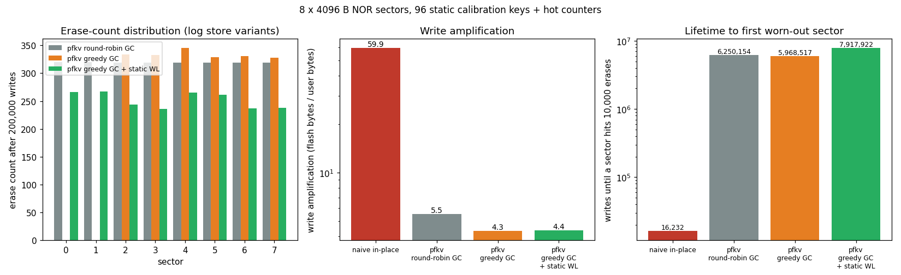

# powerfail-flash-kv

A power-loss-safe, wear-leveling key-value store in C11 for firmware engineers who keep settings, calibration and counters in raw NOR flash on Cortex-M parts. It lost **0 acknowledged writes across 32,651 injected power cuts** and lasted **~490× more writes than a naive in-place store** before the first sector wore out.



| Store (8 × 4 KiB sectors, 10k-cycle endurance) | Erase spread after 200k writes | Write amplification | Writes until first sector wears out |
|---|---:|---:|---:|
| Naive in-place (read-modify-erase-write) | 123,068 | 59.9 | 16,232 |
| pfkv, round-robin GC | 1 | 5.5 | 6,250,154 |
| pfkv, greedy GC, no static leveling | 345 | 4.3 | 5,968,517 |
| **pfkv, greedy GC + static wear leveling** | **31** | **4.4** | **7,917,922** |

| Power-cut workload | Flash ops | Cuts (clean + torn) | Nested cuts during recovery | Lost acked writes | Half-visible writes | Bad mounts |
|---|---:|---:|---:|---:|---:|---:|
| config-burst (16 keys, bursts, deletes) | 3,714 | 7,428 | 2,056 | 0 | 0 | 0 |
| counters (4 skewed monotonic counters) | 7,227 | 14,454 | 1,513 | 0 | 0 | 0 |
| mixed-sizes (1–48 B keys, 0–300 B values) | 3,262 | 6,524 | 676 | 0 | 0 | 0 |

Source data: `docs/wear_results.json` (`make bench`) and `docs/powercut_results.json` (`make powercut`).

## Quickstart

```sh
make cli                                                  # host build of the store + NOR simulator
./build/host/pfkv_cli settings.img put wifi/ssid lab-net  # write a setting to a flash image
./build/host/pfkv_cli settings.img list                   # remount the image and list all settings
```

`settings.img` is a 32 KiB NOR image (8 × 4 KiB sectors). Each run remounts it from scratch, the same way a device does after a reset. Other commands: `get KEY`, `del KEY`, `stats` (per-sector erase counts and live bytes).

## Why

Small MCUs often keep configuration in a few NOR sectors with no filesystem, and power can drop during any program or erase. The common pattern of reading a sector, erasing it and writing it back loses every key in that sector if power drops between the erase and the program. It also puts all the wear on one sector. This project shows two things with measurements rather than assuming them: once `pfkv_put()` returns, the write survives a power cut at any later step, and erases are spread evenly across sectors.

## Integrating it into firmware

Implement the four-member HAL in `include/pfkv.h` for your part, then mount once at boot:

```c
static int my_read(void *ctx, uint32_t addr, void *buf, uint32_t len);   /* any alignment */
static int my_prog(void *ctx, uint32_t addr, const void *buf, uint32_t len); /* prog_size aligned, 1->0 only */
static int my_erase(void *ctx, uint32_t sector);                          /* whole sector -> 0xFF */

static const pfkv_flash_t flash = {
    .sector_size = 2048, .sector_count = 4, .prog_size = 8,   /* e.g. STM32L4: 2 KiB pages, 64-bit writes */
    .read = my_read, .prog = my_prog, .erase = my_erase,
};
static pfkv_t kv;

pfkv_mount(&kv, &flash, NULL);               /* formats blank flash, repairs interrupted GC */
pfkv_put(&kv, "cal/adc0", &gain, sizeof gain);
pfkv_get(&kv, "cal/adc0", &gain, sizeof gain, NULL);
```

Addresses passed to the HAL are relative to the start of the partition. With FreeRTOS, use `port/freertos/pfkv_os.h`, which wraps each call in a recursive mutex.

**Sizing sectors.**
- Live data (keys + values + per-record overhead) can use at most `(sector_count − 2) × (sector_size − header)` bytes. One sector is always kept erased as the GC destination, and one more is headroom.
- Each record costs `align(16 + key + value, prog_size) + prog_size` bytes, so a 4-byte counter with a 10-byte key takes 40 B with 8-byte programming.
- One value must fit in one sector (`pfkv_max_value_len()`).
- More sectors mean fewer erases per write and longer life (see the lifetime column above).
- Compile-time limits are `PFKV_MAX_SECTORS` (32), `PFKV_MAX_KEYS` (128) and `PFKV_MAX_KEY_LEN` (64).

## How it works

- **Log of records.** Each sector starts with header A (magic, erase count, CRC), written right after an erase, and header B (sequence number + CRC), written when the sector joins the log. After the headers, records are only ever appended. A record is a 16-byte header with its own CRC, then the key and value with a payload CRC, then a separately programmed **commit unit**. The newest valid record for a key wins (by sector sequence, then by offset).
- **Atomic commit.** If power drops while a record is being programmed, the record has a bad CRC or no commit unit and is skipped at mount. The previous value stays visible. If the header itself is torn, the record length can't be trusted, so mount treats the rest of that sector as used and moves on to a new sector.
- **Garbage collection.** When the active sector is full, the least-worn free sector becomes active. If no free sector is left, GC picks a victim: the sector with the fewest live bytes (greedy) or the oldest (round-robin). It copies the victim's live records forward, then zeroes the victim's header B and only then erases the victim. A tombstone is dropped only when its sector is the oldest, so a deleted key cannot come back from an older sector.
- **Mount-time recovery.** Mount sorts sectors into data, free, blank and dirty. If every sector holds data, power was lost in the middle of GC. In that case the newest sector holds only copies of records that still exist in their source sector, so mount discards it and scans again. The RAM index (hash + address per key) is rebuilt by replaying sectors from oldest to newest.
- **Static wear leveling.** If the erase-count gap between the most-worn sector and the least-worn data sector goes above `wl_threshold`, that cold sector becomes the GC victim. Its static data moves to a worn sector, and the cold sector goes back into the free pool.
- **NOR simulator** (`sim/flash_sim.c`):
  - Enforces 1→0-only programming, aligned program units, one program per unit between erases (all-zero overwrite allowed) and whole-sector erase.
  - Can cut power at the Nth operation, either cleanly or as a torn operation. A torn program completes a random prefix plus one partly programmed byte. A torn erase either clears a random prefix or flips random bits to 1 across the whole sector.
  - The same code backs the RAM flash driver in the FreeRTOS image.

## Tests

```sh
make test       # 20 Unity tests (ASan + UBSan): API, simulator rules, GC, capacity, CRC, wear leveling, tombstones
make powercut   # exhaustive power-cut run over 3 workloads; non-zero exit on any failure
make qemu-test  # builds the FreeRTOS image, boots it in QEMU mps2-an385, requires "RESULT: PASS" on the UART
```

**What `make powercut` checks.**
- For each workload it counts the flash operations of a clean run, then replays the run with a cut at every operation: once as a clean cut and once as a torn one.
- After each cut it remounts and checks that:
  - every acknowledged write has its exact value;
  - the write that was in flight is either fully applied or not applied at all;
  - no other key changed;
  - the simulator saw no rule violations;
  - the store still accepts and persists new writes.
- If the recovery mount itself programs or erases flash (when it repairs an interrupted GC), power is cut again at each of those operations ("nested cuts").
- The harness and tests were checked against deliberately broken builds. If header B is not invalidated before an erase, the harness reports over 600k failures. If tombstones are dropped from a sector other than the oldest, the tombstone unit test fails.

**What `make qemu-test` runs.**
- Two writer tasks (1,500 counter updates; 400 config updates with deletes) and a reader task share one store through the mutex API.
- The reader checks that the counter never goes backwards and that no config value is ever seen half-written.
- A supervisor task then remounts the flash from scratch (as after a reset), checks every key and prints stack high-water marks.

Other targets: `make bench` (wear benchmark + plot), `make footprint` (writes `docs/footprint.md`). To install the toolchain on Ubuntu, run `scripts/setup_ubuntu.sh` (gcc, arm-none-eabi-gcc + newlib, qemu-system-arm, matplotlib).

## Footprint (Cortex-M3, `arm-none-eabi-gcc -Os`)

| Component | .text (flash) | .data | .bss |
|---|---:|---:|---:|
| pfkv core (src/pfkv.c) | 4149 B | 0 B | 0 B |
| FreeRTOS wrapper (pfkv_os.c) | 296 B | 0 B | 0 B |
| Whole demo image (FreeRTOS + tasks + RAM flash) | 15700 B | 4 B | 71808 B |

| RAM / stack | Bytes |
|---|---:|
| `pfkv_t` instance (32 sectors, 128 keys max) | 1528 |
| `pfkv_os_t` instance (store + static mutex) | 1608 |
| Largest library stack frame (`write_record`, -fstack-usage) | 280 |
| Task `writer_counter` peak stack use (FreeRTOS high-water mark) | 656 of 1536 |
| Task `writer_config` peak stack use (FreeRTOS high-water mark) | 656 of 1536 |
| Task `reader` peak stack use (FreeRTOS high-water mark) | 392 of 1536 |
| Task `supervisor` peak stack use (FreeRTOS high-water mark) | 568 of 1536 |

The demo's `.bss` is mostly the 48 KiB FreeRTOS heap and the 16 KiB RAM-backed flash array. Regenerate the tables with `make footprint`.

## Design notes and limitations

- **Not tested on physical hardware.** All results come from the simulator and QEMU. Real parts may fail in ways the simulator does not model: unstable bits that read differently on each read after an interrupted program, ECC faults on half-programmed words, and brown-out behaviour.
- **Index lookups read flash.** The RAM index stores a hash and an address per key; comparing keys means reading the key back from flash (memory-mapped and cheap on most MCUs). `get` re-checks the payload CRC on every read.
- **Erase counts after a torn erase.** If an erase is interrupted and destroys header A, that sector's erase count is lost. It is set to the highest known count, which errs toward treating the sector as worn.
- **Write amplification is dominated by per-record overhead** for tiny values: a 16-byte header, padding and the commit unit. Batch related small values into one key if that matters.
- **Recovery cost.** After an interrupted GC, mount repeats that GC's work, which means one extra sector erase.
- **The commit unit is partly redundant with the payload CRC** in the current failure model. It still guarantees that a record whose data happens to pass the CRC is not treated as valid unless the final program step finished.
- **Out of scope:** encryption, directories/files, bootloader integration, vendor HALs.

## Repository layout

```
include/pfkv.h          API + flash HAL interface
src/pfkv.c              the store
sim/flash_sim.[ch]      NOR simulator with power-cut injection
tests/test_pfkv.c       Unity tests
tools/powercut.c        exhaustive power-cut harness
bench/                  wear benchmark + naive in-place baseline
port/freertos/          mutex-protected wrapper
firmware/               FreeRTOS image for QEMU mps2-an385 (startup, linker script, UART, stress test)
examples/pfkv_cli.c     file-backed command-line tool
scripts/                plotting, QEMU check, footprint report, toolchain setup
```

## Third-party code

- `third_party/freertos/`: FreeRTOS Kernel V11.1.0, MIT license (`third_party/freertos/LICENSE.md`).
- `third_party/unity/`: Unity test framework by ThrowTheSwitch.org, MIT license (`third_party/unity/LICENSE.txt`).
